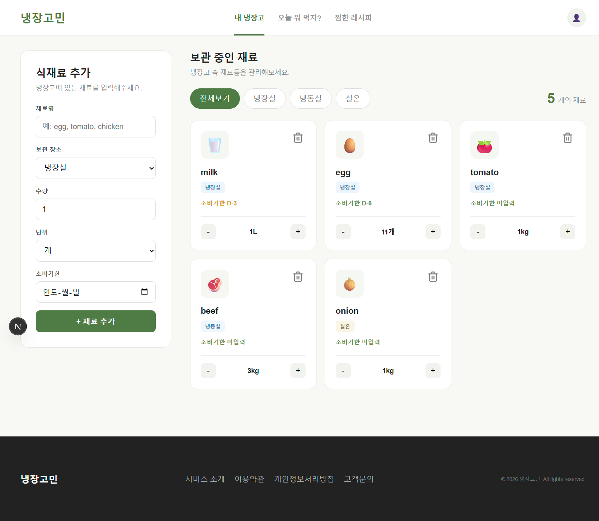
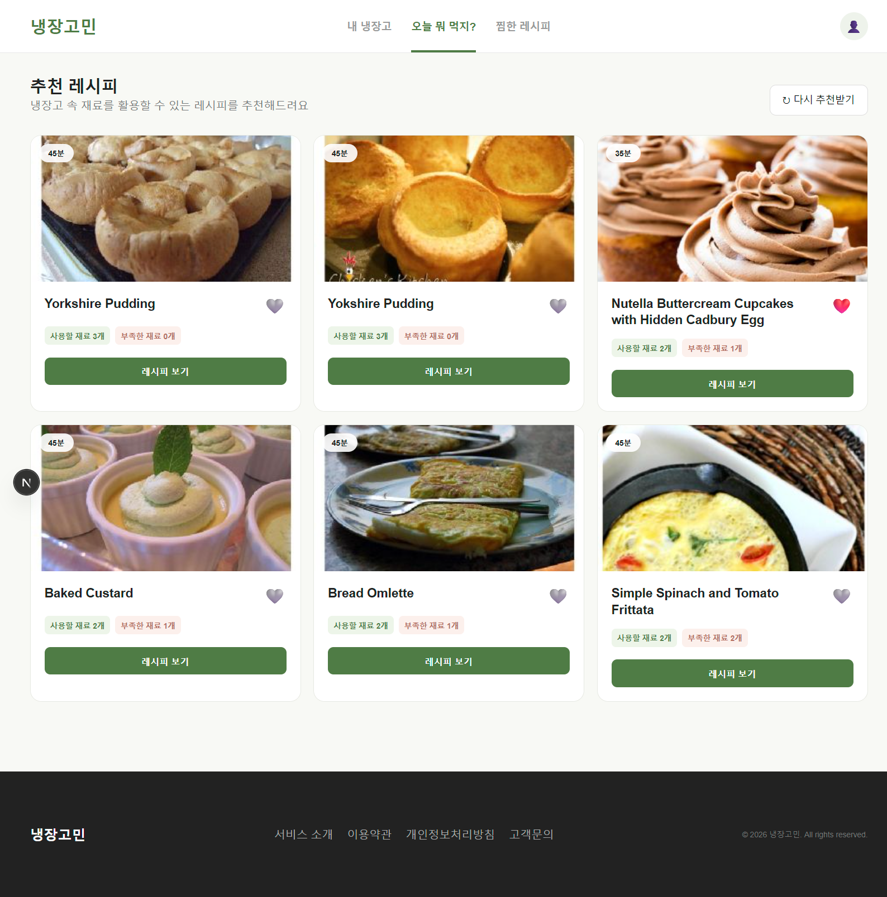
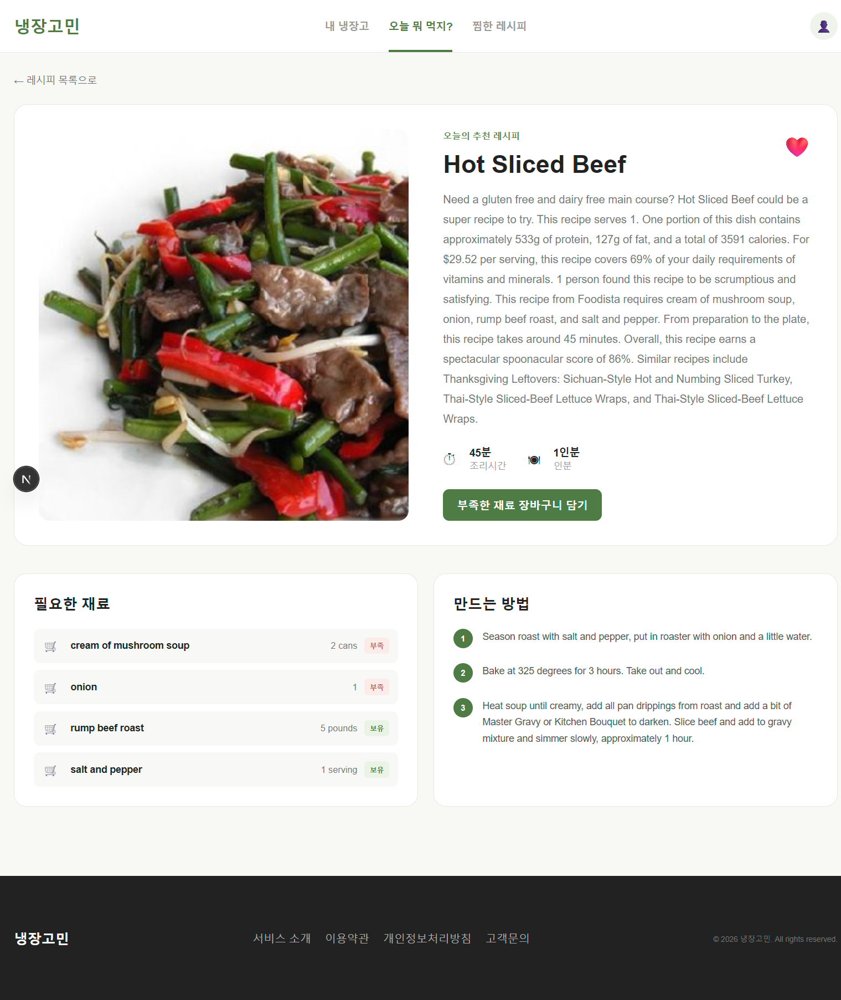
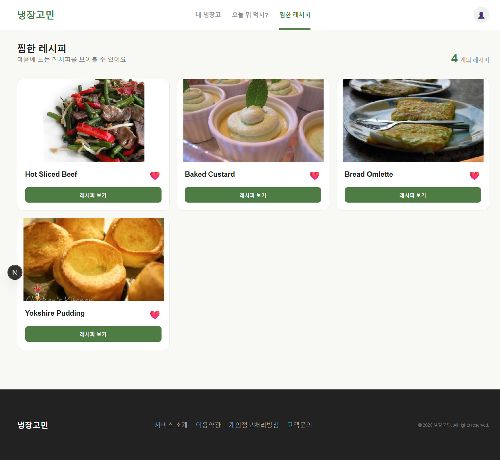
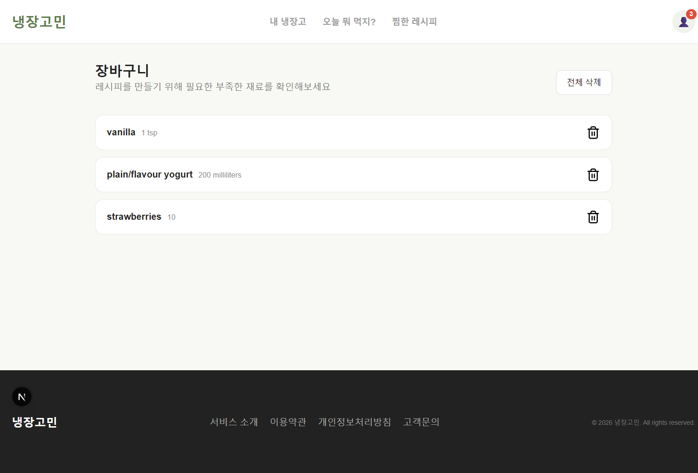

## 목차

- [프로젝트 소개](#프로젝트-소개)
- [주요 기능](#주요-기능)
- [화면 구성](#화면-구성)
- [기술 스택](#기술-스택)
- [실행 방법](#실행-방법)
- [프로젝트 구조](#프로젝트-구조)
- [주요 컴포넌트](#주요-컴포넌트)
- [상태 관리](#상태-관리)
- [트러블슈팅](#트러블슈팅)
- [프로젝트 회고](#프로젝트-회고)

---

## 프로젝트 소개

## 냉장고민 - 프론트 프로젝트

> 사용자가 냉장고 속에 있는 식재료를 관리하고, 보유한 식재료를 기반으로 레시피를 추천해 주는 Next.js 기반의 개인 프로젝트입니다.

- **개발 기간:** 2026.09.29 ~ 2026.10.01
- **주요 사용자:** 남은 식재료 처리에 고민이 많거나, 매일 메뉴 선택에 어려움을 겪는 사람
- **제작 목적:** 사용자가 보유하고 있는 재료로 효율적인 식사 준비와 스마트한 장보기 계획을 세울 수 있도록 제작했습니다.

---

## 주요 기능

| 기능        | 주소            | 설명                                                    |
| ----------- | --------------- | ------------------------------------------------------- |
| 나의 냉장고 | `/`             | 보유 중인 식재료를 조회, 등록, 수정, 삭제합니다.        |
| 레시피 추천 | `/recipes`      | 등록된 식재료를 기반으로 추천 레시피 목록을 조회합니다. |
| 레시피 상세 | `/recipes/[id]` | 선택한 레시피의 요리 순서와 필요 재료를 확인합니다.     |
| 즐겨찾기    | `/favorites`    | 찜한 레시피 목록을 모아 확인합니다.                     |
| 장바구니    | `/cart`         | 구매가 필요한 부족한 식재료 목록을 관리합니다.          |

1. 나의 냉장고 (식재료 관리)

- **식재료 등록** : 재료명, 보관 장소(냉장/냉동/실온), 수량, 단위, 소비기한을 입력하여 식재료를 등록할 수 있습니다.
- **수량 수정 및 식재료 삭제** : 등록한 식재료의 수량을 수정하거나, 소진한 식재료를 삭제할 수 있습니다.
- **보관 장소 필터링**: 전체/냉장/냉동/실온 탭을 통해 식재료를 쉽게 분류해서 보여줍니다.

> 식재료 데이터는 로컬 `db.json`을 활용한 JSON Server에 저장됩니다.

2. 레시피 추천

- **보유 식재료 기반 추천** : `나의 냉장고`에 등록된 식재료를 바탕으로 레시피를 추천합니다. (Spoonacular API 활용)
- **레시피 상세 정보** : 조리 소요 시간, 인분 수, 필요한 재료, 요리 방법(스텝별 안내)을 제공합니다.
- **식재료 비교** : 레시피에 필요한 재료 중 사용자가 보유한 재료와 보유하지 않은 재료를 구분하여 보여줍니다.

3. 장바구니 (쇼핑 리스트)

- **부족한 재료 담기** : 레시피 상세 페이지에서 사용자가 보유하고 있지 않은 재료들만 한 번에 장바구니에 추가할 수 있습니다.
- **장바구니 관리** : 저장한 식재료 목록을 확인하고, 구매했거나 필요하지 않은 식재료는 삭제할 수 있습니다.

4. 즐겨찾기

- 저장하고 싶은 레시피를 즐겨찾기에 추가하고, 전용 페이지에서 모아볼 수 있습니다.

> 장바구니와 즐겨찾기 데이터는 브라우저 로컬 스토리지에 저장되어 새로고침 후에도 유지됩니다.

---

## 화면 구성

### 메인 화면 (나의 냉장고)


식재료를 등록하여 전체 목록과 소비기한 임박 상태를 확인하고, 수량을 수정하고, 식재료를 삭제할 수 있습니다.

### 레시피 추천 화면


등록된 식재료를 바탕으로 부족한 재료 수가 적은 레시피 순으로 확인할 수 있습니다.

### 레시피 상세 화면


레시피 조리 과정과 내가 보유한 재료/부족한 재료를 한눈에 비교하고 장바구니에 담을 수 있습니다.

### 찜한 레시피 화면


사용자가 찜한 레시피를 모아서 볼 수 있습니다.

### 장바구니 화면


레시피에서 추가한 구매 필요 식재료 목록을 관리할 수 있습니다.

---

## 기술 스택

- Next.js
- React
- JavaScript
- Zustand
- JSON Server
- CSS
- Spoonacular API (레시피 데이터 연동)

---

## 실행 방법

프로젝트를 로컬 환경에서 실행하기 위한 방법입니다.

1. 저장소 클론 및 패키지 설치

```bash
git clone <repository-url>
cd <project-directory>
npm install
```

2. 환경 변수 설정

프로젝트 루트 디렉토리에 .env 파일을 생성하고 아래의 변수들을 설정합니다.
Spoonacular API 키는 공식 홈페이지에서 발급받을 수 있습니다.

```
# 로컬 JSON Server 주소
NEXT_PUBLIC_JSON_SERVER_URL=http://localhost:4000

# Spoonacular API Key
NEXT_PUBLIC_SPOONACULAR_API_KEY=발급받은_API_키
```

> JSON Server와 Next.js는 각각 실행되어야 하므로 서로 다른 터미널에서 실행합니다.

3. 데이터베이스 (JSON Server) 실행

`package.json`에는 JSON Server 실행 명령을 등록합니다.

```jsx
{
  "scripts": {
    "dev": "next dev",
    "server": "json-server --watch db.json --port 4000"
  }
}
```

본인의 프로젝트에서 사용하는 파일명과 포트가 다르다면 실제 설정에 맞게 작성합니다.

새로운 터미널 창을 열고 JSON Server를 실행합니다.

```
npm run server
또는
npx json-server --watch db.json --port 4000
```

4. Next.js 개발 서버 실행

새로운 터미널 창을 열고 프론트엔드 서버를 실행합니다.

```
npm run dev
```

브라우저에서 `http://localhost:3000`으로 접속하여 서비스를 이용할 수 있습니다.

## 프로젝트 구조

```plaintext
📦 project-root
┣ 📂 app
┃ ┣ 📂 cart # 장바구니 페이지
┃ ┣ 📂 favorites # 즐겨찾기 페이지
┃ ┣ 📂 recipes # 레시피 추천 및 상세 페이지
┃ ┣ 📜 globals.css # 전역 스타일링
┃ ┣ 📜 layout.js # 공통 레이아웃
┃ ┗ 📜 page.js # 메인 페이지
┣ 📂 components # 기능별 React 컴포넌트
┃ ┣ 📂 cart # 장바구니 관련 UI
┃ ┣ 📂 common # Header, Footer 등 공통 UI
┃ ┣ 📂 favorite # 즐겨찾기 관련 UI
┃ ┣ 📂 fridge # 냉장고 식재료 폼, 리스트, 카드 UI
┃ ┗ 📂 recipe # 레시피 리스트, 상세, 재료 리스트 UI
┣ 📂 lib # 유틸리티 및 API 통신 모듈
┃ ┣ 📜 dateUtils.js # 소비기한 D-day 계산 로직
┃ ┣ 📜 fridgeApi.js # JSON Server CRUD 로직
┃ ┗ 📜 spoonacular.js # Spoonacular API 통신 로직
┗ 📂 store # 전역 상태 관리 (Zustand)
┣ 📜 useFridgeStore.js # 장바구니 및 즐겨찾기 스토어 (Persist 적용)
┗ 📜 useStoreHydration.js # SSR Hydration 불일치 방지 커스텀 훅
```

## 주요 컴포넌트

### 1. 공통 (Common)

| 컴포넌트 | 역할                                                                                     |
| -------- | ---------------------------------------------------------------------------------------- |
| `Header` | 전체 페이지 상단에 렌더링되며, 내비게이션 링크와 장바구니 아이템 개수 배지를 표시합니다. |
| `Footer` | 웹 사이트 하단에 로고를 표시합니다.                                                      |

### 2. 나의 냉장고 (Fridge)

| 컴포넌트         | 역할                                                                       |
| ---------------- | -------------------------------------------------------------------------- |
| `IngredientForm` | 새로운 식재료를 입력받아 등록하는 폼 컴포넌트입니다.                       |
| `IngredientList` | 보유 중인 식재료 카드들을 소비기한 순으로 정렬하여 Grid 형태로 나열합니다. |
| `IngredientCard` | 개별 식재료의 상세 정보를 표시하고, 수량 증감 및 삭제 기능을 제공합니다.   |
| `StorageTabs`    | 보관 장소별로 식재료 목록을 필터링하는 탭 UI입니다.                        |

### 3. 레시피 (Recipe)

| 컴포넌트               | 역할                                                                                             |
| ---------------------- | ------------------------------------------------------------------------------------------------ |
| `RecipeGrid`           | 추천된 레시피 목록을 Grid 형태로 나열합니다.                                                     |
| `RecipeCard`           | 목록에서 개별 레시피의 썸네일, 조리 시간, 제목과 함께 보유/부족 식재료 개수를 비교해 보여줍니다. |
| `RecipeDetail`         | 선택한 레시피의 조리 순서와 상세 정보를 화면에 구성합니다.                                       |
| `RecipeIngredientList` | 레시피에 필요한 재료 목록을 보여주고, 현재 사용자가 보유하고 있는지 여부를 표시합니다.           |

### 4. 장바구니 (Cart) & 즐겨찾기 (Favorite)

| 컴포넌트             | 역할                                                                              |
| -------------------- | --------------------------------------------------------------------------------- |
| `CartList`           | 레시피 상세 페이지에서 추가한 부족 식재료 목록을 나열합니다.                      |
| `CartItem`           | 장바구니에 담긴 개별 식재료의 이름과 필요 수량을 표시하고 삭제 기능을 제공합니다. |
| `FavoriteRecipeCard` | 사용자가 찜한 레시피 정보만 별도로 렌더링하며, 찜 해제 기능을 제공합니다.         |

---

## 상태 관리

- 식재료 데이터: 페이지 내부 상태로 관리하며 JSON Server API를 통해 동기화합니다.
- 장바구니 및 즐겨찾기: Zustand로 전역 상태 관리를 구현했습니다. 로컬 스토리지를 활용해 새로고침해도 데이터가 유지됩니다.

---

## 트러블슈팅

### 1. 새로고침 시 Next.js Hydration 불일치 에러 발생 문제

#### 문제

Zustand의 persist 미들웨어를 사용하여 즐겨찾기와 장바구니 상태를 로컬 스토리지에 저장했습니다.
하지만 새로고침 시 Hydration 에러가 발생했습니다.

#### 원인

Next.js의 SSR(서버 사이드 렌더링) 단계에서는 브라우저의 로컬 스토리지에 접근할 수 없기 때문에 상태를 빈 배열로 렌더링합니다.
하지만 클라이언트 렌더링 시점에는 로컬 스토리지의 데이터를 불러와 화면을 그리려 하다 보니 두 렌더링 결과물이 달라 DOM 트리 불일치 문제가 발생한 것입니다.

#### 해결

Zustand 스토어 설정에 skipHydration 옵션을 true로 설정하여 초기 렌더링 시점에 발생하는 자동 병합을 막았습니다.
useStoreHydration.js 커스텀 훅을 만들어 useEffect를 사용해 컴포넌트가 클라이언트에 마운트된 이후에 rehydrate() 메서드를 호출해 데이터를 안전하게 동기화하도록 처리하여 문제를 해결했습니다.

#### 알게 된 점

전역 상태를 관리하는 과정에서 프레임워크의 렌더링 방식을 고려해야 한다는 점을 알게 되었습니다.
클리이언트 스토리지 접근 시점의 차이를 이해하고 안전하게 데이터를 동기화하는 방법을 알게 되었습니다.

### 2. useEffect에서 API 요청 후 cleanup을 처리하지 않은 문제

#### 문제

레시피 데이터를 불러오기 위해 Spoonacular 외부 API를 사용했습니다. 그런데 사용자가 레시피 목록이나 상세 페이지에 접속해 API 응답을 기다리던 중, 페이지를 이탈하거나 새로고침을 하는 경우가 발생할 것이라 생각했습니다.

이때, 요청을 취소하지 않으면 백그라운드에서는 사용되지 않을 응답을 기다리며 불필요한 네트워크 통신이 발생하게 됩니다.
Spoonacular API는 결제 금액에 따라 일일 요청 횟수가 정해져 있기 때문에 불필요한 요청들이 쌓이게 되면 서비스 운영 비용 증가나 서비스 차단으로 이어질 수 있었습니다.

#### 원인

API 요청과 같은 비동기 작업은 리액트 컴포넌트의 생명주기와 독립적으로 동작합니다.
비동기 요청을 보낸 후 컴포넌트가 언마운트되더라도, 자바스크립트는 백그라운드에서 해당 통신을 끝까지 진행합니다.
이로 인해 불필요한 네트워크 요청이 발생하게 됩니다.

#### 해결

이러한 비용 누수와 메모리 낭비를 방지하기 위해 useEffect 내부의 클린업 함수에서 controller.abort()를 호출하도록 구현했습니다.
API 요청을 보낼 때 AbortController의 signal을 같이 넘겨주어 fetch 요청과 AbortController를 연결해 두었기 때문에, abort()가 호출되면 즉시 중단 신호가 전달되어 요청이 취소됩니다.
리액트는 사용자가 페이지를 이탈하여 컴포넌트가 언마운트되거나 useEffect가 재실행되기 직전에 클린업 함수를 가장 먼저 실행하기 때문에, 화면을 벗어나는 순간 즉각적으로 API 요청이 차단되어 한정된 API 호출 횟수를 훨씬 효율적이고 안전하게 관리할 수 있었습니다.

```jsx
useEffect(() => {
    const controller = new AbortController();

    // API 요청 로직 (signal 전달)
    // fetch(url, { signal: controller.signal })

    return () => {
        // 클린업 함수
        controller.abort(); // 즉시 중단 신호를 보내 API 요청 취소
    };
}, []);
```

#### 알게 된 점

외부 API를 연동할 때는 단순히 데이터를 화면에 잘 보여주는 것 외에, API의 호출 제한과 과금까지 고려해 불필요한 네트워크 호출을 방어하는 프론트엔드 로직의 중요성을 배웠습니다.
useEffect의 클린업 함수가 이벤트 리스너나 타이머를 해제하는 것 외에도 진행 중인 네트워크 통신을 제어하는 핵심적인 역할을 한다는 것을 알게 되었습니다.
---

## 프로젝트 회고

이번 프로젝트에서는 Spoonacular Open API를 연동해 보며 데이터를 가공하는 과정을 경험할 수 있어서 좋았습니다.
단순히 데이터를 받아오는 것 외에 '냉장고 재료 매칭'이나 '부족한 재료 장바구니 담기' 같은 실질적인 기능들을 구현하며 기획과 설계의 중요성을 느꼈습니다.

구현 과정에서 예상치 못한 오류들도 많았지만, 직접 문제를 해결하면서 배운 내용을 복습하고 코드를 작성하는 연습도 할 수 있었습니다.

이후에는 JSON Server 대신 백엔드 데이터베이스를 설계해보고, '로그인 기능'과 '소비기한 알림 기능'까지 추가로 구현하여 확장해보고 싶습니다.
